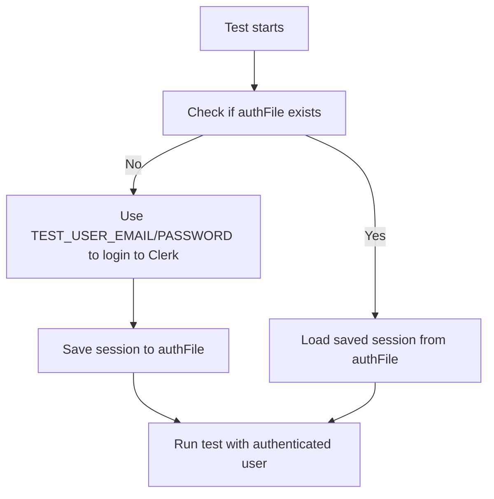

# E2E Testing Setup Guide

This guide will help you set up and run end-to-end (E2E) tests for EmuReady using Playwright.

## Table of Contents

- [Prerequisites](#prerequisites)
- [Initial Setup](#initial-setup)
- [Authentication Configuration](#authentication-configuration)
- [Running Tests](#running-tests)
- [Writing New Tests](#writing-new-tests)
- [Test Structure](#test-structure)
- [Helper Classes](#helper-classes)
- [Troubleshooting](#troubleshooting)
- [Best Practices](#best-practices)

## Prerequisites

Before setting up E2E testing, ensure you have:

1. **Node.js 18+** installed
2. **A local development environment** running
3. **Clerk account** for authentication testing
4. **Database access** (the tests run against your local development database)

## Initial Setup

### 1. Install Dependencies

All testing dependencies should already be installed when you run:

```bash
npm install
```

Key testing packages include:
- `@playwright/test` - Core Playwright testing framework
- `@clerk/testing` - Clerk integration for authentication testing

### 2. Install Playwright Browsers

Install the required browsers for testing:

```bash
npx playwright install
```

This downloads Chromium, Firefox, and WebKit browsers used by Playwright.

### 3. Verify Development Server

Ensure your development server is running:

```bash
npm run dev
```

The tests expect the application to be available at `http://localhost:3000`.

## Authentication Configuration

### 1. Clerk Test Environment Setup

E2E tests require proper Clerk configuration for authentication testing.

#### Option A: Use Existing Development Environment

If you're already set up for development, your existing Clerk keys should work for testing.

#### Option B: Create Dedicated Test Environment

For isolated testing, create a separate Clerk application:

1. Go to [Clerk Dashboard](https://dashboard.clerk.com)
2. Create a new application for testing
3. Configure the same settings as your development environment
4. Copy the API keys

### 2. Environment Variables

Create a `.env.test.local` file (if not already present) with your Clerk credentials:

```bash
cp .env.test.example .env.test.local
```

The test environment includes multiple test users with different roles:

```env
# Regular user
TEST_USER_EMAIL=user@emuready.com
TEST_USER_PASSWORD=DevPassword123!

# Author role
TEST_AUTHOR_EMAIL=author@emuready.com
TEST_AUTHOR_PASSWORD=DevPassword123!

# Moderator role
TEST_MODERATOR_EMAIL=moderator@emuready.com
TEST_MODERATOR_PASSWORD=DevPassword123!

# Developer role
TEST_DEVELOPER_EMAIL=developer@emuready.com
TEST_DEVELOPER_PASSWORD=DevPassword123!

# Admin roles
TEST_ADMIN_EMAIL=admin@emuready.com
TEST_ADMIN_PASSWORD=DevPassword123!
TEST_SUPER_ADMIN_EMAIL=admin@emuready.com
TEST_SUPER_ADMIN_PASSWORD=DevPassword123!
```

**Security Note**: Never commit real credentials to version control. Use test-specific keys only.

### 3. Test User Setup

The test users should already exist in your Clerk dashboard if you've run the database seed. If not:

1. Go to Clerk Dashboard → Users
2. Create test users with the emails above
3. Set their passwords to `DevPassword123!`
4. Make sure they're verified/active

**Note:** The user roles are managed in the database, not Clerk. Make sure your database has these users with correct roles.

## Running Tests

### Available Test Commands

```bash
# Interactive test runner with UI
npm run test:e2e

# Run tests with visible browsers
npm run test:e2e:headed

# Debug mode (opens dev tools)
npm run test:e2e:debug

# Headless mode (CI-friendly)
npm run test:e2e:headless

# Run only unauthenticated tests (no login required)
npm run test:e2e:unauth

# Generate auth states for all test users (run this first!)
npx playwright test --project=auth-setup

# Run authenticated tests as regular user
npx playwright test --project=chromium-auth-user

# Run authenticated tests as admin
npx playwright test --project=chromium-auth-admin
```

### Test Modes Explained

- **`--ui`**: Opens Playwright Test Runner GUI (best for development)
- **`--headed`**: Shows browser windows during test execution
- **`--debug`**: Pauses at each test for step-by-step debugging
- **`--reporter=list`**: Headless with minimal console output

### Running Specific Tests

```bash
# Run single test file
npx playwright test auth.spec.ts

# Run tests matching pattern
npx playwright test --grep "authentication"

# Run only failing tests
npx playwright test --last-failed
```

## Writing New Tests

### Basic Test Structure

```typescript
import { test, expect } from '@playwright/test'
import { AuthHelpers } from './helpers/auth'
import { NavigationHelpers } from './helpers/navigation'

test.describe('Feature Name', () => {
  test.beforeEach(async ({ page }) => {
    await page.goto('/')
  })

  test('should perform some action', async ({ page }) => {
    // Test implementation
  })
})
```

### Using Helper Classes

Always use the provided helper classes for common operations:

```typescript
test('authentication example', async ({ page }) => {
  const auth = new AuthHelpers(page)
  const nav = new NavigationHelpers(page)
  
  // Check authentication state
  const isAuthenticated = await auth.isAuthenticated()
  
  // Navigate with error handling
  await nav.navigateTo('/profile')
  
  // Handle mobile menu
  await nav.openMobileMenu()
  await auth.clickSignInButton(true) // mobile = true
})
```

## Test Structure

### Current Test Files

#### Legacy Tests (may need updates)
- **`auth.spec.ts`**: Authentication flows, sign in/up, protected routes
- **`navigation.spec.ts`**: Main navigation, mobile menu, routing
- **`browse.spec.ts`**: Content browsing, search, responsive design
- **`add-game.spec.ts`**: Game creation forms and validation
- **`add-listing.spec.ts`**: Listing creation forms and validation

#### Modern Tests (Page Object Model)
- **`navigation-modern.spec.ts`**: Navigation with POM architecture
- **`auth-modern.spec.ts`**: Authentication flows with better error handling
- **`browsing-modern.spec.ts`**: Content browsing and responsive design
- **`forms-modern.spec.ts`**: Form interactions and validation

### File Organization

```
tests/
├── helpers/
│   ├── auth.ts          # Authentication utilities
│   └── navigation.ts    # Navigation utilities
├── .auth/
│   ├── .gitkeep        # Preserves directory structure
│   └── *.json          # Auth state files (ignored by git)
├── global.setup.ts     # Global test setup
└── *.spec.ts          # Test files
```

## Helper Classes

### AuthHelpers

```typescript
const auth = new AuthHelpers(page)

// Check authentication state
await auth.isAuthenticated()

// Get authentication buttons
await auth.getSignInButton(mobile)
await auth.getSignUpButton(mobile)

// Click with better error handling
await auth.clickSignInButton(mobile)

// Wait for Clerk components
await auth.waitForAuthComponents()
await auth.waitForClerkModal('sign-in')

// Check for auth requirements
await auth.hasAuthRequirement()
```

### NavigationHelpers

```typescript
const nav = new NavigationHelpers(page)

// Navigation with error handling
await nav.navigateTo('/games')
await nav.clickNavLink('Games')
await nav.waitForURLChange('/games')

// Mobile menu operations
await nav.openMobileMenu()
await nav.closeMobileMenu()
await nav.isMobileMenuOpen()

// Responsive testing
await nav.setViewport('mobile')
```

## Setting Up Authentication

### First Time Setup

1. **Ensure test users exist in Clerk**:
   - Check your Clerk dashboard
   - Verify all test users are created and active

2. **Generate authentication states**:
   ```bash
   npx playwright test --project=auth-setup
   ```
   This creates auth state files for all user roles in `tests/.auth/`

3. **Verify auth files were created**:
   ```bash
   ls -la tests/.auth/
   # Should see: user.json, admin.json, moderator.json, etc.
   ```

### Cookie Banner Issues

If tests fail due to cookie banners:

1. Tests include automatic cookie banner dismissal
2. For UI mode (`npm run test:e2e`), cookie banners may persist
3. Use headless mode for more reliable results: `npm run test:e2e:headless`

## Troubleshooting

### Common Issues and Solutions

#### 1. Tests Timing Out

```bash
# Increase timeout for slow operations
npx playwright test --timeout=60000
```

**Causes**:
- Slow network requests
- Animations not completing
- Components not loading

**Solutions**:
- Add explicit waits: `await page.waitForTimeout(1000)`
- Wait for specific elements: `await page.waitForSelector('.component')`
- Use helper methods that include retries

#### 2. Authentication Failures

**Error**: "Error reading storage state from tests/.auth/user.json"

**Solutions**:
- Run auth setup first: `npx playwright test --project=auth-setup`
- Verify test users exist in Clerk dashboard
- Check `.env.test.local` has correct credentials

**Error**: "Sign In button not found"

**Solutions**:
- Verify Clerk configuration in `.env.test.local`
- Check that Clerk components are loading
- Cookie banner might be blocking - tests handle this automatically

#### 3. Browser Crashes (WebKit)

**Error**: "Target page, context or browser has been closed"

**Solutions**:
- Run tests individually: `npx playwright test auth.spec.ts`
- Use specific browser: `npx playwright test --project=chromium`
- Add browser crash detection in helpers

#### 4. Mobile Menu Issues

**Error**: Mobile menu state detection fails

**Solutions**:
- Use improved `NavigationHelpers.isMobileMenuOpen()`
- Add `data-testid` attributes to menu components
- Test on actual mobile viewport: `page.setViewportSize({ width: 375, height: 667 })`

#### 5. Strict Mode Violations

**Error**: "locator resolved to X elements"

**Solutions**:
- Use `.first()`: `page.locator('button').first()`
- Use more specific selectors: `page.getByRole('button', { name: 'Submit' })`
- Add `data-testid` attributes

### Debugging Tips

#### 1. Visual Debugging

```bash
# Run with headed mode to see what's happening
npm run test:e2e:headed

# Use debug mode for step-by-step execution
npm run test:e2e:debug
```

#### 2. Add Debug Information

```typescript
// Log available elements
console.log('Available buttons:', await page.locator('button').allTextContents())
console.log('Current URL:', page.url())
console.log('Page content:', await page.textContent('body'))
```

#### 3. Screenshots and Videos

```typescript
// Take screenshot on failure
await page.screenshot({ path: 'debug-screenshot.png' })

// Record video (configured in playwright.config.ts)
```

## Best Practices

### 1. Test Independence

- Each test should be independent and not rely on previous tests
- Use `test.beforeEach()` for setup
- Clean up after tests if needed

### 2. Robust Selectors

```typescript
// ✅ Good: Specific and resilient
page.getByRole('button', { name: 'Sign In' })
page.getByTestId('submit-button')

// ❌ Bad: Fragile CSS selectors
page.locator('.btn.btn-primary')
page.locator('div > button:nth-child(2)')
```

### 3. Error Handling

```typescript
// Always include try-catch for critical operations
try {
  await page.getByRole('link', { name: 'Games' }).click()
  await page.waitForURL('/games', { timeout: 5000 })
} catch {
  // Fallback navigation
  await page.goto('/games')
}
```

### 4. Responsive Testing

```typescript
// Test mobile-specific behavior
test.describe('Mobile Tests', () => {
  test.beforeEach(async ({ page }) => {
    await page.setViewportSize({ width: 375, height: 667 })
  })
  
  // Mobile-specific tests
})
```

### 5. Authentication Patterns

```typescript
// Check auth requirement before testing forms
const auth = new AuthHelpers(page)
const hasAuthRequirement = await auth.hasAuthRequirement()

if (hasAuthRequirement) {
  // Test auth flow
} else {
  // Test form functionality
}
```

### 6. Data Test IDs

Add `data-testid` attributes to components for reliable testing:

```tsx
// In your components
<button data-testid="submit-button">Submit</button>
<form data-testid="add-game-form">...</form>
```

```typescript
// In tests
page.getByTestId('submit-button')
page.getByTestId('add-game-form')
```

## Performance Considerations

### 1. Parallel Execution

Tests run in parallel by default. For tests that require isolation:

```typescript
test.describe.configure({ mode: 'serial' })
```

### 2. Browser Reuse

Playwright automatically reuses browser contexts for better performance.

### 3. Test Timeouts

Configure appropriate timeouts in `playwright.config.ts`:

```typescript
export default defineConfig({
  timeout: 30000, // 30 seconds per test
  expect: { timeout: 5000 }, // 5 seconds for assertions
})
```

## Continuous Integration

For CI environments, ensure:

1. Use headless mode: `npm run test:e2e:headless`
2. Set appropriate environment variables
3. Consider using test sharding for large test suites
4. Store test artifacts (screenshots, videos) on failure

```bash
# Example CI command
npx playwright test --reporter=html --output-dir=test-results
```

### Flowchart of Authentication Process




## Getting Help

- Check existing test files for examples
- Review Playwright documentation: https://playwright.dev
- Check Clerk testing documentation: https://clerk.com/docs/testing
- Look at helper class implementations for common patterns

## Contributing Test Improvements

When contributing new tests or improvements:

1. Follow existing patterns and helper usage
2. Add appropriate error handling and fallbacks
3. Test across different browsers and viewports
4. Update this documentation if adding new patterns
5. Ensure tests are deterministic and not flaky 
